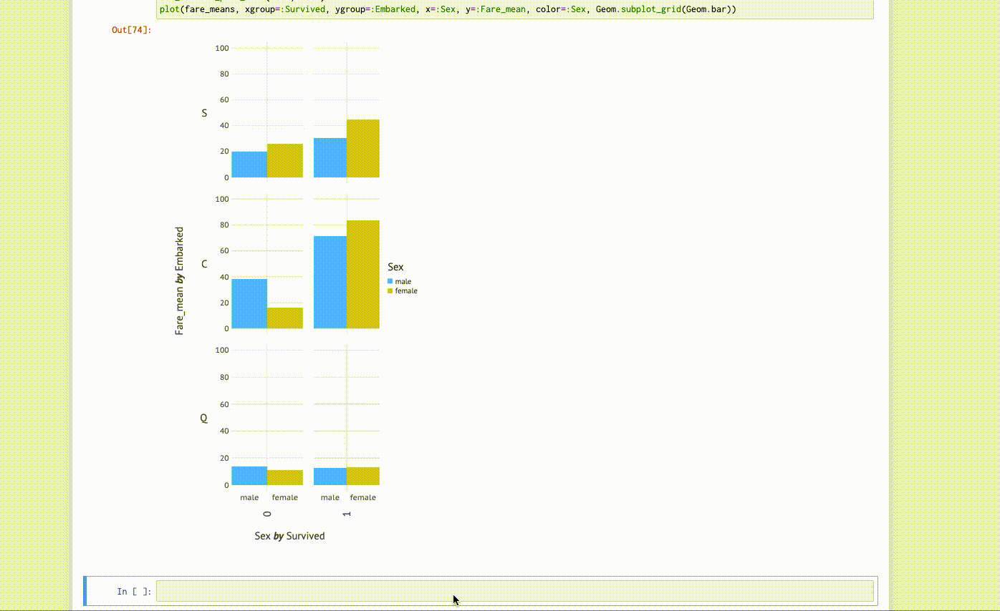

# Gen.jlでKaggle入門

---

## 自己紹介

- 塚本真人
- 株式会社Fusic
- 普段はRoRでweb開発してます
- 趣味: ポケモン
- qiita: https://qiita.com/TsuMakoto
- github: https://github.com/TsuMakoto


---


## 動機
普段の業務でWeb開発で機械学習なんかはやってないので、

可能性をひろげたい！

- Juliaでやりたい
- JuliaTokaiでちょっとだけGen.jlの話がでたから
- 具体的な目標(ターゲット)がほしい

---

## そうだKaggleをやろう

---

## Gen.jl

---

## 2019-07-01

MIT、「Julia」上で動作する

### 初心者向け**汎用AIプログラミングシステム**「Gen」

を発表

自動化されたAIを、

コンピューターサイエンスや数学の専門知識をさほど必要とせずとも、

容易に扱えるようにする

---

## よさそうじゃね？

---

## Juliaで前処理

最低限は下の4つを使えば問題ないはず


```julia

using CSV
using DataFrames
using DataFramesMeta
using Gadfly

```

---

## Juliaで前処理
pythonとの対応

- pandas => DataFrames と DataFramesMeta
- pyplot, seaborn => Gadfly


---

## Juliaで前処理(データ解析)

### Python
```py
train_df[["Pclass", "Survived"]]
  .groupby(['Pclass'], as_index=False)
  .mean()
  .sort_values(by='Survived', ascending=False)
```

## Julia

```julia
@linq train[!, [:Pclass, :Survived]] |>
        by(:Pclass,
           Survived_mean = DataFrames.mean(:Survived)) |>
        orderby(:Pclass)
```

---

## Juliaで前処理(データ可視化)

### Python

```py

grid = sns.FacetGrid(train_df, row='Embarked', size=2.2, aspect=1.6)
grid.map(sns.pointplot, 'Pclass', 'Survived', 'Sex', palette='deep')
grid.add_legend()

```

## Julia

```julia
survived_means = @linq train[:, [:Sex, :Embarked, :Survived, :Pclass]] |>
                         dropmissing(:Embarked) |>
                         by([:Embarked, :Sex, :Pclass],
                            Survived_mean = DataFrames.mean(:Survived))

set_default_plot_size(20cm, 10cm)
plot(survived_means, xgroup=:Embarked,
     x=:Pclass, y=:Survived_mean,
     color=:Sex, Geom.subplot_grid(Geom.line))
```

---

## Gen.jlへ
今回、Kaggleで有名なTitanicのデータセットを使いました。

```julia

train = dataread("./dataset/titanic/train.csv")
test  = dataread("./dataset/titanic/test.csv");

#
# データ加工して、各列をカテゴライズする
#

X_train = Matrix(re_train[!, Not(:Survived)])
Y_train = Vector(re_train[!, :Survived])
X_test  = Matrix(re_test)

```

---

## Gen.jlのTutorialをみてみる

https://www.gen.dev/intro-to-modeling/Introduction%20to%20Modeling%20in%20Gen

---

## Tutorial: Introduction to Modeling in Gen

基本ここに書いてあることをすすめていけば、

精度はどうであれ、Kaggleができる！

---

## 2. Writing a probabilistic model as a generative function
2値の推論なので、ロジスティック回帰モデルをつかう

```julia

sigmoid(val) = 1.0 / (1.0 + exp(-val))

size(X_train)

@gen function logistic_model(X::Matrix{Int64})
    param_addrs = [:intercept, :β1, :β2, :β3, :β4, :β5, :β6, :β7]
    m,s = 0, 10
    n = size(X, 1)
    y = Vector{Float64}(undef, n)
    _X = hcat(ones(n), X)
    ws = map(address -> @trace(normal(m, s), address), param_addrs)
    for i ∈ 1:n
        p = sigmoid(_X[i,:]' * ws)
        y[i] = @trace(bernoulli(p), (:y, i))
    end
end

```

---

## 3. Doing Posterior inference

```julia
function do_inference(model, xs, ys, amount_of_computation)
    observations = Gen.choicemap()
    for (i, y) in enumerate(ys)
        observations[(:y, i)] = y
    end

    (trace, _) = Gen.importance_resampling(model, (xs,), observations, amount_of_computation);
    return trace
end

# 推論を実行
traces = [do_inference(logistic_model, X_train, Y_train, 100) for _=1:10];

```

---

## 4. Predicting new data

```julia
function predict_new_data(model, trace, new_xs, param_addrs)
    constraints = Gen.choicemap()
    for addr in param_addrs
        constraints[addr] = trace[addr]
    end

    (new_trace, _) = Gen.generate(model, (new_xs,), constraints)

    n = size(new_xs, 1)
    ys = [new_trace[(:y, i)] for i=1:n]
    return ys
end

function infer_and_predict(model, traces, new_xs, param_addrs)
    pred_ys = []
    for trace ∈ traces
        push!(pred_ys, predict_new_data(model, trace, new_xs, param_addrs))
    end
    pred_ys
end;

infer_and_predict(
    logistic_model, traces, X_test, [:intercept, :β1, :β2, :β3, :β4, :β5, :β6, :β7])

```

---

## 感想

- JuliaでもKaggleはできそう(Juliaカーネル復活してくれ)
- Gen.jlは基本チュートリアルのコピペで実行までもっていけた
- 事後確率の更新式がないので、他のチュートリアルを進める必要がありそう

---

## 終わり？？

---

## にしようかとおもったのですが 。。。。
このままだと若干寂しいので、

このオレオレチュートリアルを行っている時に、

tips?(小ネタ)を見つけたので共有

---

## せっかくのOSSのお祭りなので
Gadfly.jlへPRをなげてきました

----

## バグ？
Jupyter notebookでPlotすると

セルに'-'とか'+'とか入力すると、イベントが発生。

グラフのサイズがかわったりして、かなり遅くなるし

なにより気持ち悪い



---

## めっちゃうざい

こんな感じでkeymapをきれたらなあ...

```julia

Gadfly.plotroot_keymap(false)

```

---

## 結果

---

## 結果

マージされませんでした。。。。😢

---

## 理由

前はこんなのがあったらしい。(今は消えてるらしい)

```julia

set_default_plot_format(:svg)

```

---

## 理由

解決はIJulia/Jupyterのときに

問題を切り分けて個別に対策していくらしい

---

## 一時的な解決

以下でjavascriptを無効にできる(でも、毎回呼ぶのめんどくさい。。。)

```julia

p = plot()
draw(SVG(), p)

```

---

## ありがとうございました

OSS貢献活動、Kaggle(機械学習)ともに個人的につづけていきます!!
